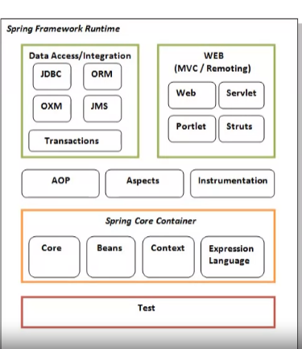
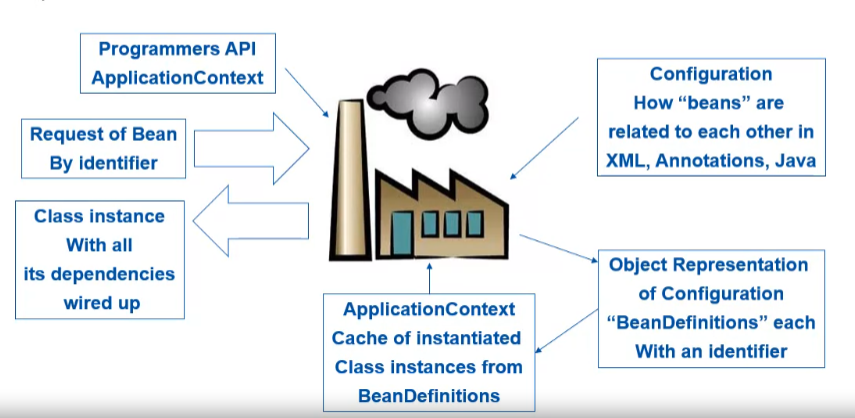

# The Spring Ecosystem

## Definition

- The Spring Framework provides a progamming and configuration model for 
Java-based enterprise applications;

- Spring focuses on the "plumbing" of enterprise applications so that teams
can focus on applications-level business logic;

- Spring is a lightweight framework that addresses each tier in a Web application
  - Presentation layer - An MVC framework that is most similar to Struts but is more
    powerful and easier to use;
  - Business layer - Lightweight IoC container and AOP support;
  - Persistence layer - DAO template supports for popular ORMs and JDBC;

- Spring is complimentary in that it manages implementations of Sub Systems through
its own core distribution of Classes and Configurations files to make a coders life 
easier
  - Rest Services
  - Persistence
  - Security

## Advantages

- Spring is the most popular application development framework for enterprise Java.

- Spring framework is an open source Java platform

- Spring is organized in a modular fashion

- Spring makes use of some of the existing technologies like several Persistence Frameworks,
logging frameworks, Web Service Frameworks

- Spring Testing framework makes it testable

- Promotes decoupling and reusability

- Allows developers to focus more on business logic and less on plumbing problems

- Removes common code issues like leaking connections and more

- Has built-in aspects such as transaction management

- Built on design patterns - proven solutions that work

## Nuts and Bolts

- A container
  - Creates objects and makes them available to your application
  - Uses a declarative XML structure to define components that "live" in the container

- A framework
  - Provides an infrastructure of classes that makes it easier to accomplish tasks
  - for example, template provides an abstraction away from the details fo dataAccess, remote
    calling


## Dependency Management

- Manages collaboration (dependencies) between Plain Old Java Objects (POJOs)
  - Code to interfaces

- Spring Instantiates specific interface implementations
  - Don't need

    ```java

      InterfaceType anObject = new InterfaceImpl();
    ```

  - But uses Spring to provide the specific interface implementations of your objects

## Inversion of Control

- The basic concept of the inversion of control pattern is that programmers don't need to create patterns to other objects. However, at compile time the "calling class" has no knowledge of the dependency class implementation it will delegate to at Runtime. Because our Delegator Class code is coded to the interface abstraction of the delegating class.

- With Spring, the implementations of the dependency injection can be achieved via setter and/or constructor injection techniques

## Core Modules

- The Spring Framework comprises of many modules such as core, beans, context, expression language, AOP, Aspects, Instrumentation, JDBC, ORM, OXM, JMS, transaction, web, servlet, struts, etc.

- These modules are grouped into:
  - Test
  - Core container
  - Aspect Oriented Programming (AOP)
  - Aspects
  - Instrumentation
  - Data Access/Integration
  - Web (MVC/Remoting)

- The Spring Core container contains core, beans, context and expression language (EL) modules

<p align="center">
    
p>

- Core and beans; These modules provide IOC and Dependency injection features

- Context; This module supports internationalziation

- Expression Language; It is an extension to the EL defined in JSP. It provides support to setting and getting property values and even method invocation

- AOP, Aspects and Instrumentation; These modules support aspect oriented programming implementation where you can use advices, pointcuts

- The aspects module provides support to integration with AspectJ

- Data Access / Integration; These modules basically provide support to interact with the database

- Web; This group provide support to create web applications

## Spring is like a factory

<p align="center">
    
p>
z